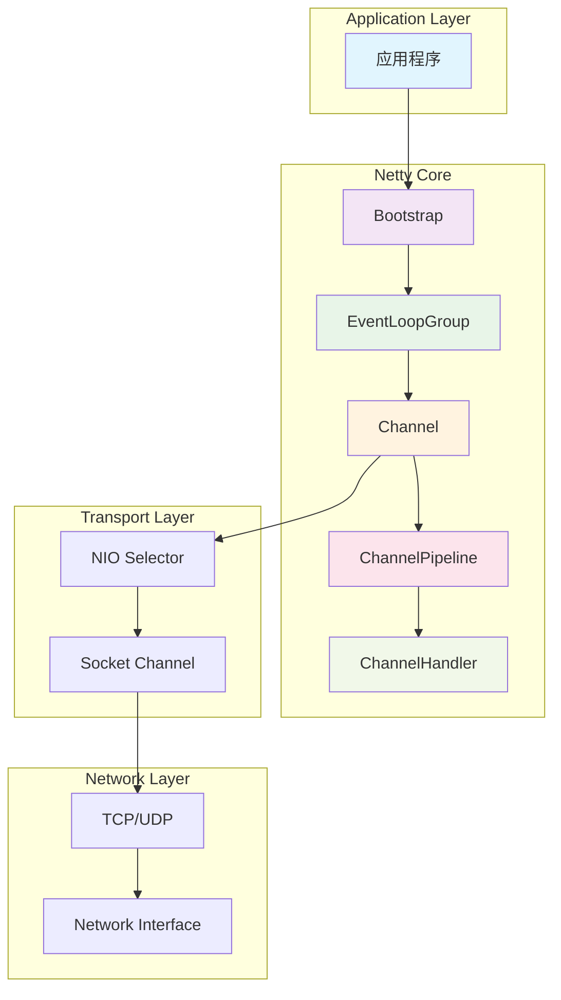
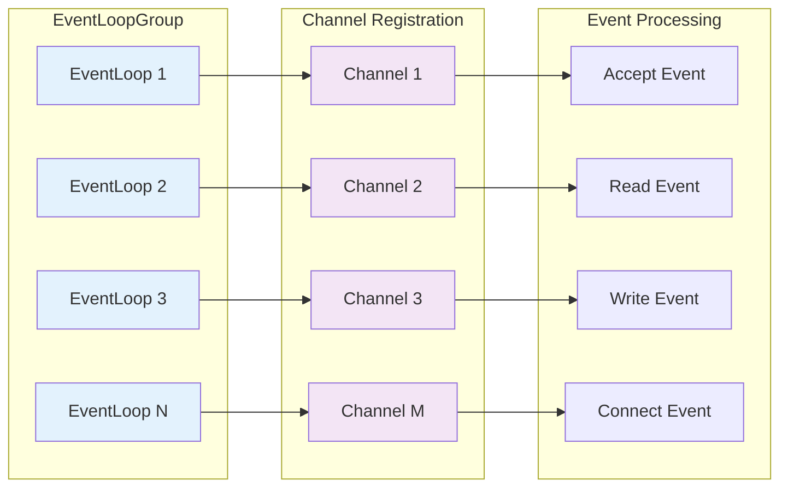
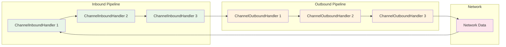
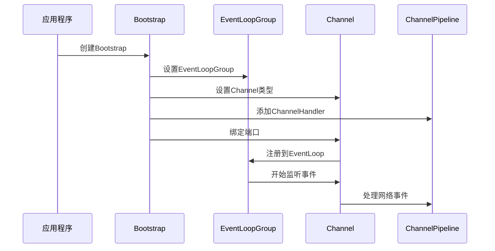
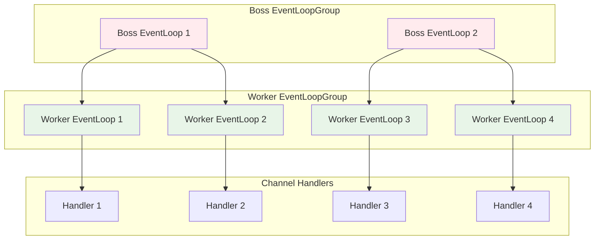
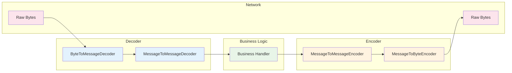
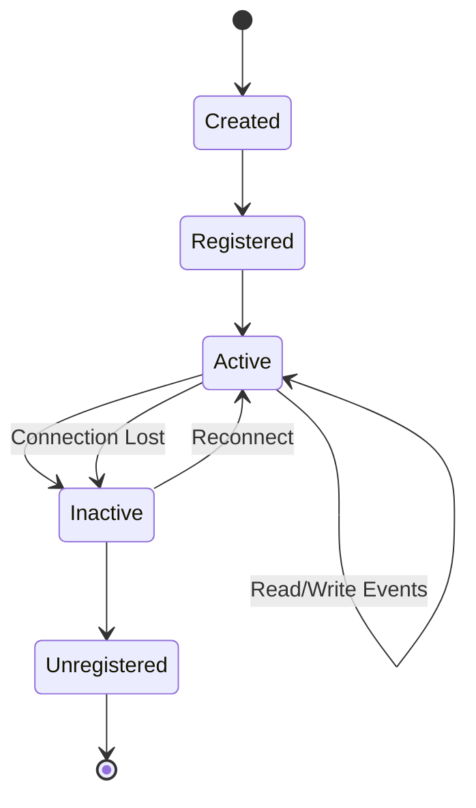
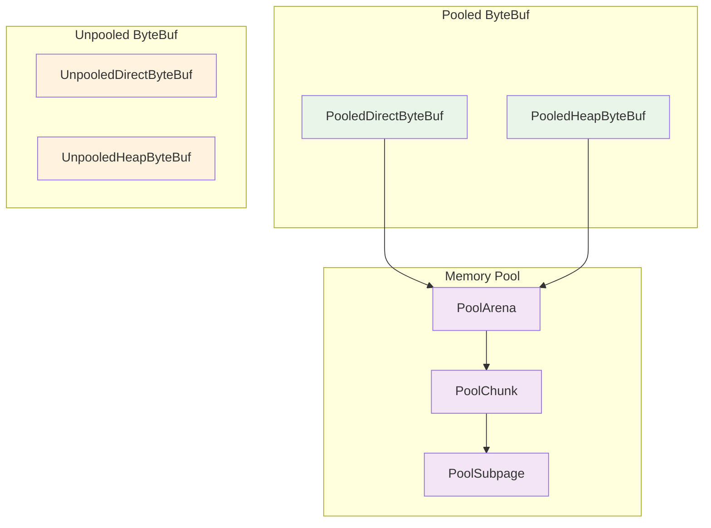

# Netty-Java 架构原理图

## 1. Netty 整体架构图

## 2. EventLoop 工作原理

## 3. ChannelPipeline 数据流

## 4. Bootstrap 启动流程

## 5. 线程模型

## 6. 数据编解码流程

## 7. 连接生命周期

## 8. 内存管理

## 核心组件说明

### 1. Bootstrap
- **作用**: 客户端和服务端的启动引导类
- **功能**: 配置Channel、EventLoopGroup、ChannelHandler等

### 2. EventLoopGroup
- **作用**: 管理EventLoop的线程池
- **功能**: 处理Channel的I/O操作和事件

### 3. Channel
- **作用**: 网络连接的抽象
- **功能**: 代表一个网络连接，可以读写数据

### 4. ChannelPipeline
- **作用**: ChannelHandler的容器
- **功能**: 处理入站和出站的数据流

### 5. ChannelHandler
- **作用**: 处理I/O事件和数据
- **类型**: 
  - ChannelInboundHandler: 处理入站数据
  - ChannelOutboundHandler: 处理出站数据

### 6. ByteBuf
- **作用**: Netty的字节缓冲区
- **特点**: 比Java NIO ByteBuffer更高效

## 工作原理总结

1. **启动阶段**: Bootstrap配置并启动EventLoopGroup
2. **连接阶段**: 创建Channel并注册到EventLoop
3. **事件处理**: EventLoop监听网络事件并分发给ChannelPipeline
4. **数据处理**: ChannelHandler链式处理数据
5. **资源管理**: 自动管理内存和连接资源

Netty通过这种设计实现了高性能、高并发的网络应用框架。 